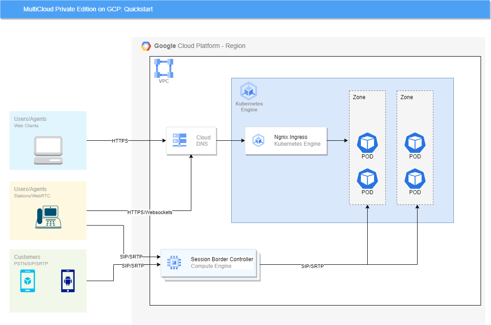
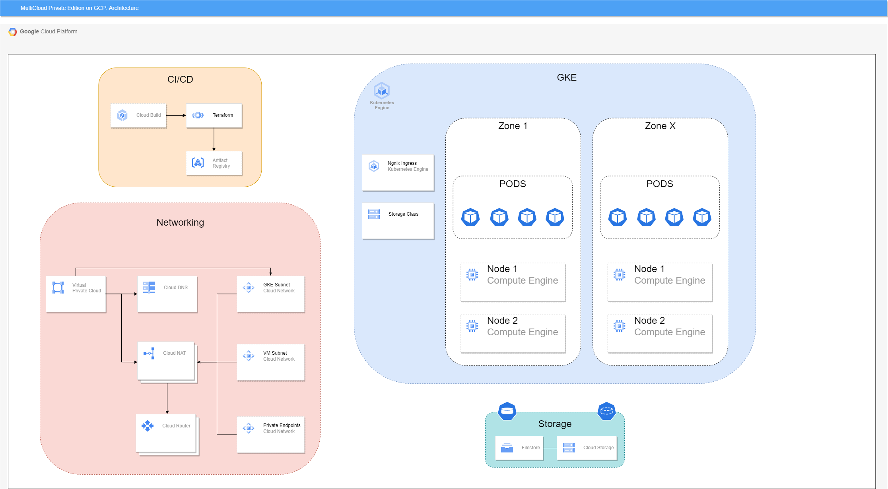

# Genesys Multicloud CX Private Edition - Quickstart on GCP

The purpose of this repository is to provide sample platform reference architecture for deploying Genesys Multicloud CX Private Edition containers and Helm charts to Google Kubernetes Engine (GKE). The content provided in this repository SHOULD NOT be used directly for Production environments as it is not designed to meet typical HA, DR, service sizing, multi-region or Security requirements. All content is being provided AS-IS without any SLA, warranty or coverage via Genesys product support.

This project is derived from the following two repositories maintained by the Genesys Product Teams:
* [MultiCloud Platform](https://github.com/genesys/multicloud-platform)
* [MultiCloud Services](https://github.com/genesys/multicloud-services)

## Architecture

## Getting Started with Quickstart
The scripts provided in this repository assumes a newly created and dedicated GCP project for MultiCloud Private Edition is created. The Terraform files will provision the newly created Google Project with the necessary Google API's and services (GKE, etc) and prepare the project and GKE cluster for MultiCloud Private Edition. Once the GKE cluster is stood up, then the provided Helm Charts will execute one by one to stand up the MultiCloud Private Edition services (GAuth, Voice, WWE, IWD, etc).

Cloud Build is a serverless CI/CD platform provided by GCP and has been chosen to execute the provided Terraform files and Helm Charts. In one of the first steps, a Terraform job will create and stage the Cloud Build triggers and once these are created, then the rest of the platform can be setup in an automated fasion.

To keep this initial ReadMe short and not cluttered, a dedicated "Manual" folder has been created and is broken down into a few ReadMe's that will guide you through provisioning GCP and the MultiCloud Private Edition stack. Please navigate to [0-GettingStarted](manual/0-GettingStarted.md) to get started!

## License
All content in this repository is released under the [MIT License](LICENSE)